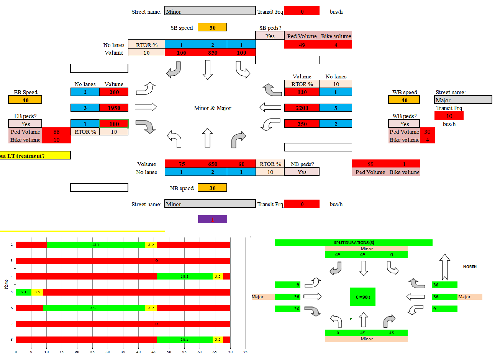
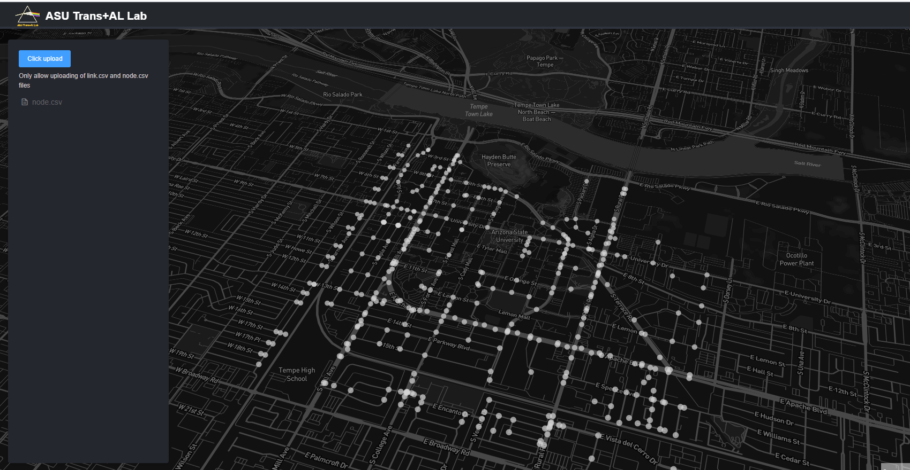
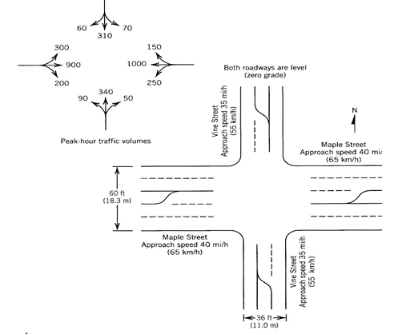
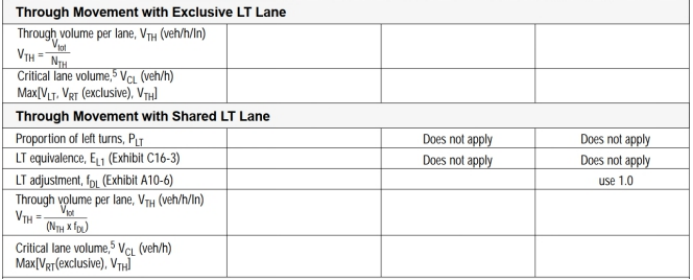

# Vol2Timing

This python tool aims to offer a **light-weight computational engine** to
generate optimize signal control timing data, and analyze the effectiveness of
signal control strategies. Our goal is to **automate** the process of optimizing
**movement-based**, **phase-based** signal control strategy and provide the
interfaces for other mesoscopic and microscopic Analysis, Modeling and
Simulation (**AMS**), based on Highway Capacity Manual’s Quick Estimation
Method, and [GMNS](https://github.com/zephyr-data-specs/GMNS) based network
files.

The users and students can follow the steps below to learn and use this set of
tools.

**Step 1: Familiar with Excel based Tool**

Please check out the tool developed by Dr. Milan Zlatkovic at University of
Wyoming
(http://www.uwyo.edu/civil/faculty_staff/faculty/milan-zlatkovic/index.html,
mzlatkov\@uwyo.edu) for his Excel based Quick Estimation Method

1.1. Excel files:
https://github.com/milan1981/Sigma-X/blob/master/Sigma-X_v2_GMNS.xlsm

1.2: Youtube teaching video: <https://www.youtube.com/watch?v=Q1CxQFM9D5U>

1.3: Research paper: Zlatkovic, Milan, and Xuesong Zhou. "Integration of signal
timing estimation model and dynamic traffic assignment in feedback loops: System
design and case study." *Journal of Advanced Transportation* 49, no. 6 (2015):
683-699. ([Open
Access](https://onlinelibrary.wiley.com/doi/full/10.1002/atr.1295))

1.4. Try to test different results from different movement configurations at
https://github.com/asu-trans-ai-lab/vol2timing/tree/master/examples/
3_simple_cases

|                                     |                                                                                          |                                                                                                                                                                                                                                                                                |
|-------------------------------------|------------------------------------------------------------------------------------------|--------------------------------------------------------------------------------------------------------------------------------------------------------------------------------------------------------------------------------------------------------------------------------|
| Case 1: 3 lanes EW                  | [media/d6fc220943245a2e6165e130cc68ec13.png](media/d6fc220943245a2e6165e130cc68ec13.png) | CL=50 s [media/d8ce5f326dd28ffa02db2140bdae72e0.png media/0085320a445815036aa59c86d26c0c56.png media/2c974551e67cd44ee4635125da9a7193.png](media/d8ce5f326dd28ffa02db2140bdae72e0.png media/0085320a445815036aa59c86d26c0c56.png media/2c974551e67cd44ee4635125da9a7193.png)   |
| 4 lanes EW with left turn volume    | [media/2fda34a037204763b42bdf2f714c5789.png](media/2fda34a037204763b42bdf2f714c5789.png) | CL =150 s [media/f09ee76a4115abd17f80df38349509d7.png media/7455294d81f8a8da6a3951b3832a5e58.png media/12c12afd0aad2764b6ca0ad2253bdac9.png](media/f09ee76a4115abd17f80df38349509d7.png media/7455294d81f8a8da6a3951b3832a5e58.png media/12c12afd0aad2764b6ca0ad2253bdac9.png) |
| 4 lanes EW without left turn volume | [media/29da9800250df786f860c1f13f674eaf.png](media/29da9800250df786f860c1f13f674eaf.png) | CL =80 s [media/f2ac8d7b8a82c3aa6166aa38f62c7145.png media/6bcb91bf61305e1f69ddbdfb1c22cdbd.png media/df605e6ee51382482e8144262fdc9465.png](media/f2ac8d7b8a82c3aa6166aa38f62c7145.png media/6bcb91bf61305e1f69ddbdfb1c22cdbd.png media/df605e6ee51382482e8144262fdc9465.png)  |

**\#Highlights:**

Planning-level analysis of existing intersections

Estimation of signal timing parameters for known inputs

Major elements: Left-turn treatment; Lane volume; Signal timing; Critical
intersection volume-to-capacity ratio; Control delay & LOS

**Step 2: Python package-based tool**

This python version aims to generate movement-based, phase-based signal control
strategy, developed by the research teams led by Dr. Xuesong (Simon) Zhou at
Arizona State University (xzhou74\@asu.edu) and Dr. Milan Zlatkovic at
University of Wyoming

>   Table 1. Folders of Vol2Timing package

| **Github Folder Name** | **Contents**                                         |
|------------------------|------------------------------------------------------|
| src                    | source code of Vol2Timing                            |
| Release                | Python test code and data set                        |
| Doc                    | User’s guide and other documentations for Vol2Timing |
| Examples               | Simple test cases and real world examples            |

2.1. Test data set at for ASU network

<https://github.com/asu-trans-ai-lab/vol2timing/tree/master/release>

In this release folder, we have input files of (1) node.csv, (2) link.csv (3)
movement.csv, and output files of (1) signal_timing_phase.csv, (2)
signal_phase_mvmt.csv in GMNS format, as well as (3) timing.csv for quick
mesoscopic and microscopic simulation.

To visualize the location of signal intersections, please create a node.csv
contains only nodes with field osm_highway== “traffic_signals”, and use
<https://asu-trans-ai-lab.github.io/index.html#/> to visualize the locations of
signalized intersections.

2.2. Try test script at

(1) Python code at
https://github.com/asu-trans-ai-lab/vol2timing/blob/master/release/test.py

(2) Jupyter Notebook at
<https://github.com/asu-trans-ai-lab/vol2timing/blob/master/vol2timing.ipynb>

(3) Utah State Street example from the original osm file at

<https://github.com/asu-trans-ai-lab/vol2timing/tree/master/examples/Utah_state_street>

2.3. For advanced users, you can check out our source code at
<https://github.com/asu-trans-ai-lab/vol2timing/tree/master/src>, and learn the
steps from the log file (\*.log)

Other useful references:

(1) Nourmohammadi, Fatemeh, Mohammadhadi Mansourianfar, Sajjad Shafiei, Ziyuan
Gu, and Meead Saberi. "An Open GMNS Dataset of a Dynamic Multi-modal
Transportation Network Model of Melbourne, Australia." *Data* 6, no. 2 (2021):
21.

<https://www.mdpi.com/2306-5729/6/2/21/htm>

Pleas check out the nice [relational
structure](https://www.mdpi.com/data/data-06-00021/article_deploy/html/images/data-06-00021-g001.png)
of the developed General Modeling Network Specification (GMNS) dataset, in Fig.
1.

**Step 3: Practice problem**

>   Fig.1 Sample problem from text book

Step 1. Input information

First, we should extract movement, volume, and lane information from Fig.1.

| **Movement**     | EBL | EBT | EBR | WBL | WBT  | WBR | NBL | NBT | NBR | SBL | SBT | SBR |
|------------------|-----|-----|-----|-----|------|-----|-----|-----|-----|-----|-----|-----|
| **Volume**       | 300 | 900 | 200 | 250 | 1000 | 150 | 90  | 340 | 50  | 70  | 310 | 60  |
| **No. of lanes** | 1   | 1   | 1   | 1   | 1    | 1   | 1   | 1   | 1   | 1   | 1   | 1   |
| **Shared lanes** | \-  | \-  | \-  | \-  | \-   | \-  | \-  | \-  | \-  | \-  | \-  | \-  |

Step 2. Select signal phasing

1.  **Determine left-turn treatment**

There are several principles for determining left-turn treatment.

1.  **Left-turn lane check**

Criterion: If the number of left-turn lane on any approach exceeds 1, then it is
recommended that the left turns on that approach be protected.

1.  **Minimum volume Check**

Criterion: If left-turn volume on any approach exceeds 240 veh/h, then it is
recommended that the left turns on that approach be protected.

1.  **Opposing Through Lanes Check**

Criterion: If there are more than 4 or more through lanes on the opposing
approach, then it is recommended that the left turns on that approach be
protected.

1.  **Opposing Traffic Speed Check**

Criterion: If the opposing traffic speed exceeds 45mph, then it is recommended
that the left turns on that approach be protected.

1.  **Minimum Cross-Product Check**

Criterion:

Protected+permissive:

| **Number of Through Lanes** | **Minimum Cross-Product** |
|-----------------------------|---------------------------|
| 1                           | 50000                     |
| 2 or more                   | 100000                    |

Protected only:

| **Number of Through Lanes** | **Minimum Cross-Product** |
|-----------------------------|---------------------------|
| 1                           | 150000                    |
| 2 or more                   | 300000                    |

Calculation: cross-product for each left-turn

| **Movement**                                                | EBL | WBL | NBL | SBL |
|-------------------------------------------------------------|-----|-----|-----|-----|
| **Opposing Through Lanes**                                  |     |     |     |     |
| **Cross-Product**                                           |     |     |     |     |
| **Exceed Protected Minimum Cross-Product?(Y/N)**            |     |     |     |     |
| **Exceed Protected+Permissive Minimum Cross-Product?(Y/N)** |     |     |     |     |
| **Protected decision**                                      |     |     |     |     |

1.  **Comparing results**

Based on the analysis above, we can reach the left-turn final decision.

**QEM result**

| **Movement**            | EBL                  | WBL                  | NBL       | SBL       |
|-------------------------|----------------------|----------------------|-----------|-----------|
| **Left-turn Treatment** | Protected+Permissive | Protected+Permissive | Permitted | Permitted |

**Vol2Timing result**

| **Movement**            | EBL       | WBL       | NBL       | SBL       |
|-------------------------|-----------|-----------|-----------|-----------|
| **Left-turn Treatment** | Protected | Protected | Protected | Protected |

1.  **Determine phasing sequence**

**QEM result**

|           | **Final Ring-Barrier Movement** |   |   |   |
|-----------|---------------------------------|---|---|---|
| **Ring1** | 1                               | 2 | 3 | 4 |
| **Ring2** | 5                               | 6 | 7 | 8 |

**Vol2Timing result**

|           | **Final Ring-Barrier Movement** |   |   |   |
|-----------|---------------------------------|---|---|---|
| **Ring1** | 1                               | 2 |   | 4 |
| **Ring2** | 5                               | 6 |   | 8 |

Step 3. Compute flow rates & adjusted saturation flow rate

>   **Right-turn Movement**

>   **Left-turn Movement**

>   **Through Movement**

>   **Through Movement with exclusive LT lane & shared LT lane**

>   **Saturation flow rate**

**for protected phase:**

The default value of saturation flow rate for protected phase is 1530veh/h/lane

**for permissive phase(for left-turn):**

The default value of saturation flow rate for permissive phase is
150-200veh/h/lane

>   **Comparing results**

Based on the analysis above, we can calculate saturation flow rate.

**QEM result**

| **Movement**            | EBL  | EBT  | EBR  | WBL  | WBT  | WBR  | NBL | NBT  | NBR  | SBL | SBT  | SBR  |
|-------------------------|------|------|------|------|------|------|-----|------|------|-----|------|------|
| **Saturaion flow rate** | 1530 | 1530 | 1530 | 1530 | 1530 | 1530 | 0   | 1530 | 1530 | 0   | 1530 | 1530 |

**Vol2Timing result**

| **Movement**            | EBL  | EBT  | EBR  | WBL  | WBT  | WBR  | NBL  | NBT  | NBR  | SBL  | SBT  | SBR  |
|-------------------------|------|------|------|------|------|------|------|------|------|------|------|------|
| **Saturaion flow rate** | 1530 | 1530 | 1530 | 1530 | 1530 | 1530 | 1530 | 1530 | 1530 | 1530 | 1530 | 1530 |

Step 4. Determine critical lane groups & total cycle lost time

**（1）Determine critical lane groups**

To determine the critical lane group for each stage, we should select the lane
group with maximum v/s(v: volume, s: saturation rate) for each stage.

**QEM result**

| **Stage**               | 1   | 2   | 3   |
|-------------------------|-----|-----|-----|
| **Critical lane group** | EBL | WBT | NBL |

**Vol2Timing result**

| **Stage**               | 1   | 2   | 3   | 4   |
|-------------------------|-----|-----|-----|-----|
| **Critical lane group** | EBL | WBT | NBL | NBT |

**（2）Determine total cycle lost time**

The total cycle lost time is given as

where

**QEM result**

= 4s\*3 = 12s

**Vol2Timing result**

= 4s\*4 = 16s

Step 5. Calculate cycle length

A practical equation for the calculation of the cycle length that seeks to
minimize

vehicle delay was developed by Webster (1969). Webster’s optimum cycle length

formula is

where

**QEM result**

**Vol2Timing result**

Step 6. Allocate green time

There are several strategies for allocating the green time to the various
stages. One of the most popular and simplest is to distribute the green time so
that the *v*/*c* ratios are equalized for the critical lane groups, as by the
following equation:

where

**QEM result**

| **Stage** | 1  | 2  | 3 | 4  |
|-----------|----|----|---|----|
| **Ring1** | 24 | 86 | 0 | 30 |
| **Ring2** | 28 | 82 | 0 | 30 |

**Vol2Timing result**

| **Stage** | 1 | 2  | 3 | 4  |
|-----------|---|----|---|----|
| **Ring1** | 9 | 36 | 5 | 12 |
| **Ring2** | 9 | 36 | 5 | 12 |

Step 7. Calculate capacity and V/C ratio

Capacity can be calculated as follows:

where

Then we can calculate the ratio of V/C.

**QEM results**

| **Movement**      | EBL | EBT | EBR | WBL | WBT | WBR | NBL | NBT | NBR | SBL | SBT | SBR |
|-------------------|-----|-----|-----|-----|-----|-----|-----|-----|-----|-----|-----|-----|
| **Capacity(veh)** | 338 | 896 | 896 | 294 | 852 | 852 | 65  | 284 | 284 | 65  | 284 | 284 |

**Vol2Timing results**

| **Movement**            | EBL   | EBT | EBR | WBL   | WBT | WBR | NBL   | NBT | NBR | SBL   | SBT | SBR |
|-------------------------|-------|-----|-----|-------|-----|-----|-------|-----|-----|-------|-----|-----|
| **Saturaion flow rate** | 280.5 | 969 | 969 | 280.5 | 969 | 969 | 178.5 | 357 | 357 | 178.5 | 357 | 357 |

Step 8. Calculate Signal Delay and LOS

**QEM results**

| Movement                   | EBL               | EBT   | EBR   | WBL   | WBT   | WBR   | NBL    | NBT    | NBR   | SBL   | SBT   | SBR   |
|----------------------------|-------------------|-------|-------|-------|-------|-------|--------|--------|-------|-------|-------|-------|
| Phase                      | 5                 | 2     | 2     | 1     | 6     | 6     | 0      | 8      | 8     | 0     | 4     | 4     |
| UnifDelay (s)              | 16.1              | 29    | 13.62 | 19.06 | 31    | 15.06 | 57     | 57     | 47.82 | 57    | 57    | 48.11 |
| IncDelay (s)               | 27.65             | 30.07 | 0.5   | 25.25 | 89    | 0.4   | 242.05 | 118.81 | 1.19  | 135.4 | 79.57 | 1.48  |
| ControlDelay (s)           | 43.8              | 59.1  | 14.1  | 44.3  | 120.0 | 15.5  | 299.1  | 175.8  | 49.0  | 192.4 | 136.6 | 49.6  |
| LOS                        | D                 | E     | B     | D     | F     | B     | F      | F      | D     | F     | F     | D     |
| Approach Delay (s)         | 49.4              |       |       | 95.3  |       |       | 185.7  |        |       | 133.6 |       |       |
| Approach LOS               | D                 |       |       | F     |       |       | F      |        |       | F     |       |       |
|                            |                   |       |       |       |       |       |        |        |       |       |       |       |
| **Intersection Delay (s)** | **95.1**          |       |       |       |       |       |        |        |       |       |       |       |
| **Intersection LOS**       | **F**             |       |       |       |       |       |        |        |       |       |       |       |
| **Intersection V/C**       | **1.07**          |       |       |       |       |       |        |        |       |       |       |       |
| **Intersection Status**    | **Over Capacity** |       |       |       |       |       |        |        |       |       |       |       |

**Vol2Timing results**

| Movement                   | EBL               | EBT   | EBR   | WBL   | WBT    | WBR   | NBL   | NBT   | NBR   | SBL  | SBT   | SBR  |
|----------------------------|-------------------|-------|-------|-------|--------|-------|-------|-------|-------|------|-------|------|
| Phase                      | 5                 | 2     | 2     | 1     | 6      | 6     | 0     | 8     | 8     | 0    | 4     | 4    |
| UnifDelay (s)              | 433.7             | 196.0 | 136.5 | 270.0 | \-40.3 | 107.2 | 91.1  | 944.3 | 120.7 | 85.2 | 553.5 | 82.6 |
| LOS                        | D                 | E     | B     | D     | F      | B     | F     | F     | D     | F    | F     | D    |
| Approach Delay (s)         | 95.8              |       |       | 42.8  |        |       | 640.1 |       |       | 380  |       |      |
| Approach LOS               | F                 |       |       | D     |        |       | F     |       |       | F    |       |      |
|                            |                   |       |       |       |        |       |       |       |       |      |       |      |
| **Intersection Delay (s)** | **95.1**          |       |       |       |        |       |       |       |       |      |       |      |
| **Intersection LOS**       | **F**             |       |       |       |        |       |       |       |       |      |       |      |
| **Intersection V/C**       | **1.07**          |       |       |       |        |       |       |       |       |      |       |      |
| **Intersection Status**    | **Over Capacity** |       |       |       |        |       |       |       |       |      |       |      |
